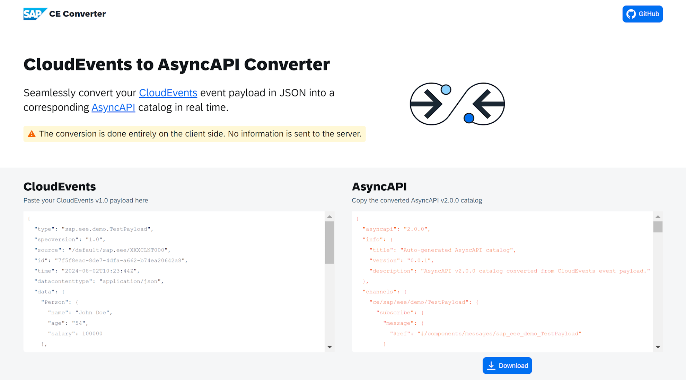

[](https://api.reuse.software/info/github.com/SAP/cloudevents-asyncapi-converter)

# Converter for CloudEvents to AsyncAPI

*Converter for CloudEvents to AsyncAPI* is a Node.js library and CLI application that converts any event payload conforming to the [CloudEvents](https://github.com/cloudevents/spec) specification into an [AsyncAPI](https://www.asyncapi.com/docs) catalog which can be used in an ABAP environment to generate an [Event Consumption Model](https://help.sap.com/docs/abap-cloud/abap-development-tools-user-guide/generating-event-consumption-model).

Find the official web application hosted on GitHub Pages at https://sap.github.io/cloudevents-asyncapi-converter.

Find the official CLI application and library at https://github.com/SAP/cloudevents-asyncapi-converter.

> [!NOTE]
> CloudEvents® is a registered trademark of The Linux Foundation.


## Usage



1. Paste your CloudEvents event payload into the left input
2. Copy or download the resulting AsyncAPI catalog from the right output
3. Edit the catalog manually according to your requirements
4. Use the AsyncAPI file in the creation of an Event Consumption Model

### Limitations

The payload converter only generates a rough AsyncAPI catalog solely based on the CloudEvents payload by inferring data types in a naïve manner. Consequently, it exhibits some limitations that require manual adjustments to the payload prior to conversion or to the resulting catalog.

* Properties with value `null` or empty objects `{}` in the payload are currently rejected by the converter.
* String properties are not analyzed with regards to their data format and have none assigned.
* Numeric properties always receive the data format `decimal` by the converter.
* For compositions of objects, the converter is currently unable to link parent and child schemas through references. Instead, it treats them independently of each other.

  <details>
    <summary><b>Details</b></summary>

  Suppose your payload has nested schemas like the `ComplexCollection` below, containing objects of the type `Complex`.

  ```json
  // ...
  "ComplexCollection": [
    {
      "Amount": 100.000,
      "Currency": "KWD",
      "Quantity": 1000.000,
      "Unit": "KG",
      "Alpha": "1"
    },
    // ...
  ],
  "Complex": {
    "Amount": 0.000,
    "Currency": "KWD",
    "Quantity": 0.000,
    "Unit": "KG",
    "Alpha": "1"
  },
  // ...
  ```

  Rather than linking the items of `ComplexCollection` to the `Complex` schema, the converter creates individual schemas for each object.

  ```json
  // ...
  "schemas": {
    "ComplexCollection": {
      "type": "array",
      "items": {
        "$ref": "#/components/schemas/sap_eee_iwxbe_testproducer_v1_Event_DeepStructure_ComplexCollection"
      }
    },
    "Complex": {
      "type": "object",
      "$ref": "#/components/schemas/sap_eee_iwxbe_testproducer_v1_Event_DeepStructure_Complex"
    },
    // ...
    "sap_eee_iwxbe_testproducer_v1_Event_DeepStructure_ComplexCollection": {
      "type": "object",
      "properties": {
        "Amount": {
          "type": "number",
          "format": "decimal"
        },
        "Currency": {
          "type": "string"
        },
        "Quantity": {
          "type": "number",
          "format": "decimal"
        },
        "Unit": {
          "type": "string"
        },
        "Alpha": {
          "type": "string"
        }
      }
    },
    "sap_eee_iwxbe_testproducer_v1_Event_DeepStructure_Complex": {
      "type": "object",
      "properties": {
        "Amount": {
          "type": "number",
          "format": "decimal"
        },
        "Currency": {
          "type": "string"
        },
        "Quantity": {
          "type": "number",
          "format": "decimal"
        },
        "Unit": {
          "type": "string"
        },
        "Alpha": {
          "type": "string"
        }
      }
    }
  }
  ```
  </details>


## Support, Feedback, Contributing

This project is open to feature requests/suggestions, bug reports etc. via [GitHub issues](https://github.com/SAP/cloudevents-asyncapi-converter/issues). Contribution and feedback are encouraged and always welcome. For more information about how to contribute, the project structure, as well as additional contribution information, see our [Contribution Guidelines](CONTRIBUTING.md).


## Security / Disclosure

If you find any bug that may be a security problem, please follow our instructions at [in our security policy](https://github.com/SAP/cloudevents-asyncapi-converter/security/policy) on how to report it. Please do not create GitHub issues for security-related doubts or problems.


## Code of Conduct

We as members, contributors, and leaders pledge to make participation in our community a harassment-free experience for everyone. By participating in this project, you agree to abide by its [Code of Conduct](https://github.com/SAP/.github/blob/main/CODE_OF_CONDUCT.md) at all times.


## Licensing

Copyright 2024 SAP SE or an SAP affiliate company and *cloudevents-asyncapi-converter* contributors. Please see our [LICENSE](LICENSE) for copyright and license information. Detailed information including third-party components and their licensing/copyright information is available [via the REUSE tool](https://api.reuse.software/info/github.com/SAP/cloudevents-asyncapi-converter).
